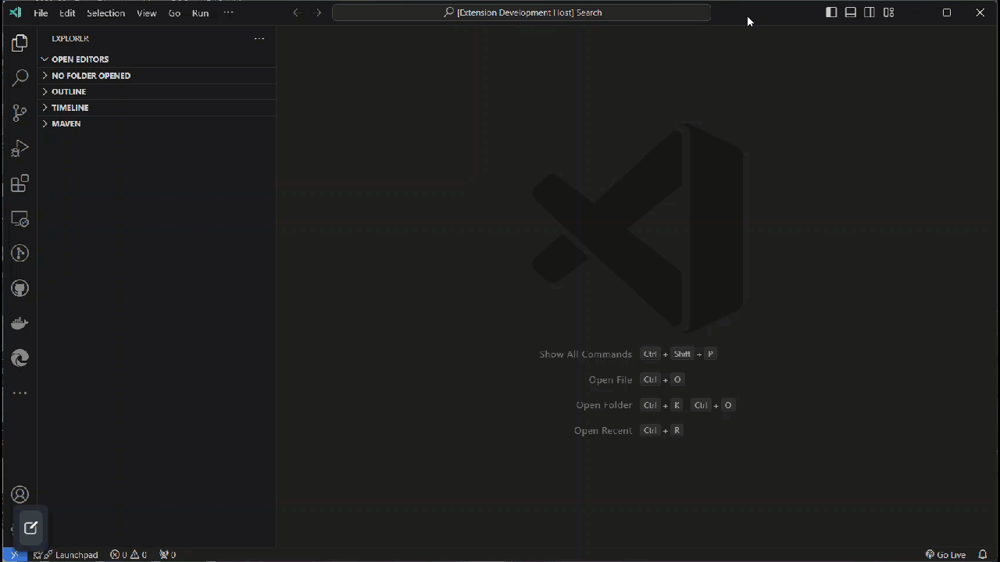
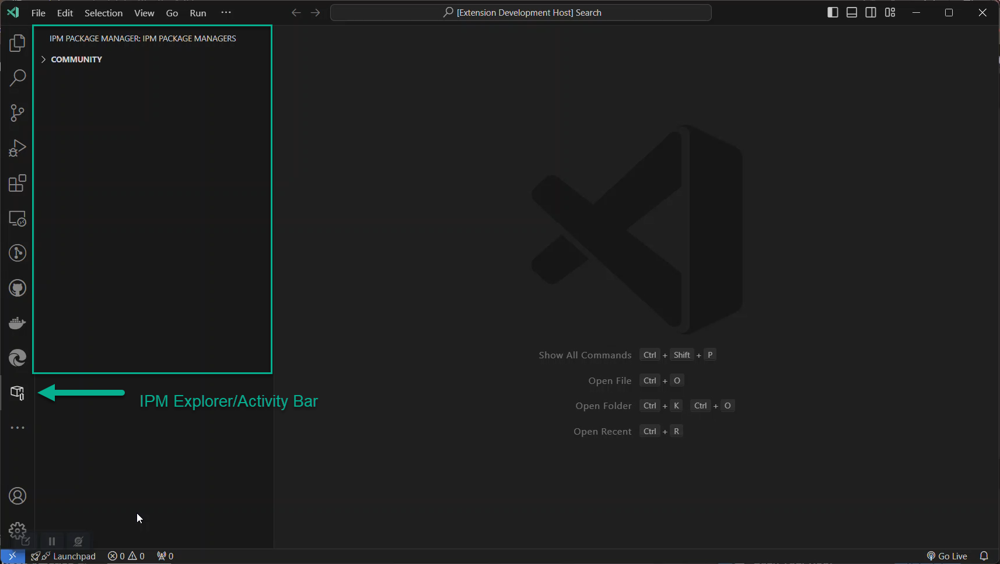
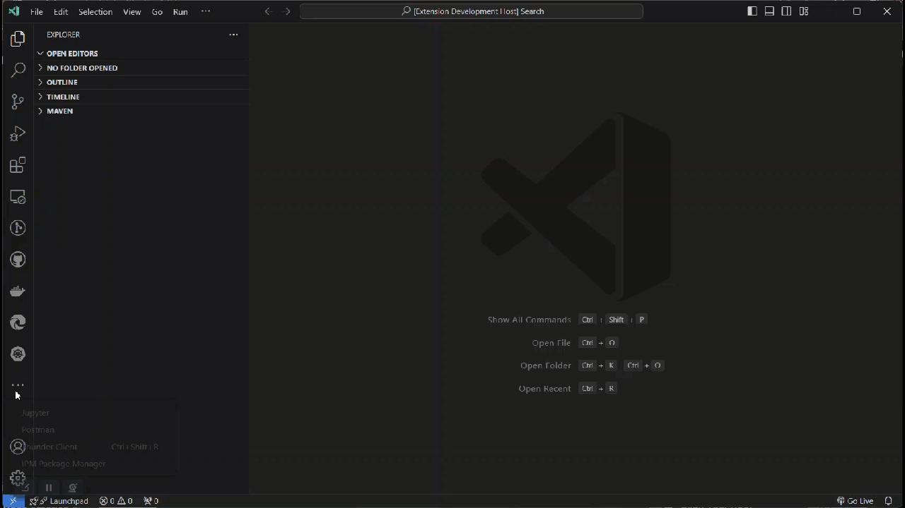

# IPM Explorer VS Code Extension README

This is an [Visual Studio Code](https://code.visualstudio.com/) extension that enables users to query, display and install [Intersystems Package Manager](https://community.intersystems.com/tags/intersystems-package-manager-ipm) repositories. IPM is very similar to package managers like [nuget](www.nuget.org) or [npm](www.npmjs.org), just built and target at Intersystems products.

## Installation

You can install this extension from the VS Code marketplace here

## Features

### IPM VS Code Settings

Multiple Package Manager locations defined in the users VS Code preferences (settings file).


### IPM Activity Bar

A custom activity bar for dispaying the package managers



### Listing of Packages
Displaying with action buttons packages that available from each configured IPM Url.


### Action buttons for each package

Provides action buttons to copy the ZPM install command (to use in a IRIS terminal) and open repository for each package.



## Requirements
This extension does not have any specific requirements for it to run outside of a IPM registry.

A soft requirement would be that you need a Intersystems IRIS or IRIS 4 Health environment with the IPM application installed.

## Extension Settings

This extension contributes the following settings:

* `ipm.repositories`: Array of objects that list each of the IPM registries that you would like to show in the activity explorer.
``` json
    "ipm.repositories": [
        {
            "name":"Community",
            "url":"https://pm.community.intersystems.com"
        }
    ]
```

## Release Notes

For release notes view our [changelog.md](CHANGELOG.md) file.
